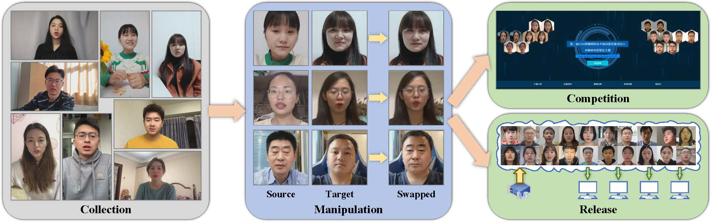

# FMFCC-V
FMFCC-V: A Large-Scale Challenging Asian Dataset for DeepFake Detection

## FMFCC-V Dataset



The FMFCCV dataset is by far the first and the largest public available Asian dataset for DeepFake Detection. There are in total 38102 DeepFake videos and 44290 pristine videos, corresponding more than 23 million frames, in the FMFCC-V dataset. The source videos are collected from 83 paid individuals speaking in a variety of conditions for roughly 40 minutes each. All individuals are Asians and give consents to the use and manipulation of their faces by signing a formal agreement. The DeepFake videos are generated using four kinds of most popular face swapping methods for roughly 16 minutes each before post processing. In addition, we introduced diversity into both DeepFake videos and pristine videos through deliberate addition of twelve kinds of perturbations, simulating real world scenarios. Based on the FMFCC-V dataset and other existing DeepFake datasets, we benchmark video-level results of six representative DeepFake detection methods. The complete FMFCC-V dataset and the detailed analysis will be presented in a paper. A part of FMFCC-V dataset used in the FMFCC-V competition can be downloaded from https://pan.baidu.com/s/1yaBcMP7ckvVI8KGf_Avk7Q (Password: 2021).

The structure of a part of FMFCC-V dataset is:
```
FMFCC-V-Competition
|--metadata.json
|--videos_30000_part1.zip
|--videos_30000_part2.zip
|--videos_30000_part3.zip
|--videos_30000_part4.zip
```
The structure of a part of FMFCC-V dataset is:
```
FMFCC-V-Competition
|--metadata.json
|--videos_30000_part1.zip
|--videos_30000_part2.zip
|--videos_30000_part3.zip
|--videos_30000_part4.zip
```
where `metadata.json` is the

## FMFCC-V Competition


Based on the FMFCC-V dataset, we have successfuly hosted a benchmark competition named Video track of the first Fake Media Forensic Challenge of China Society of Image and Graphics (FMFCC-V). The FMFCC-V competition attracted over 400 contestants who come from 60 organizations. The monetary prizes provided a large incentive for these contestants to dedicate a lot of time and computational resources to optimize DeepFake detection algorithms for benchmarking. Compared with the DFDC competition organized by FaceBook, we only gather the metadata of predictions rather than the source codes and models for protecting the intellectual property rights of the contestants. Based on the result of the FMFCC-V competition, we provided a detailed analysis of top submissions. The details will be presented in a paper. The homepage of FMFCC-V competition is
http://fmfcc.net.

## Acknowledgements

If you use the FMFCC-V dataset, please cite the following paper:
```
@inproceedings{XXX,
  title = {FMFCC-V: A Large-Scale Challenging Asian Dataset for DeepFake Detection},
  author = {Gen Li, Xianfeng Zhao, Yun Cao, Pengfei Pei, Jinchuan Li, Zeyu Zhang},
  booktitle = {XXX},
  year = {2021}
}
```
or cite the online document:
```
@online{XXX,
  title = {FMFCC-V: A Large-Scale Challenging Asian Dataset for DeepFake Detection},
  author = {Gen Li, Xianfeng Zhao, Yun Cao, Pengfei Pei, Jinchuan Li, Zeyu Zhang},
  url = {https://github.com/iiecasligen/FMFCC-V/},
  year = {2021}
}
```
